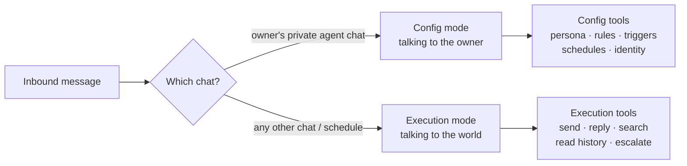
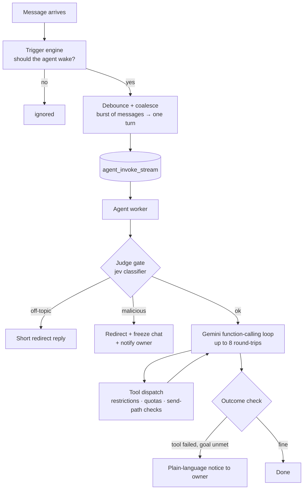
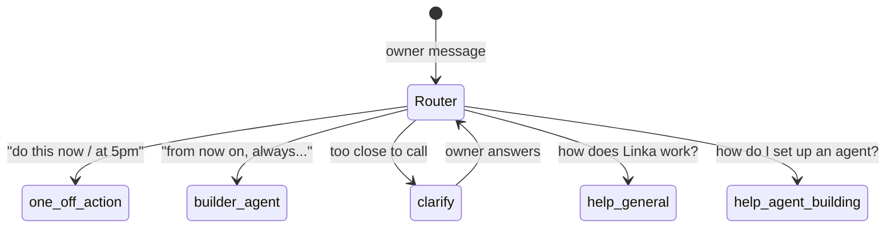
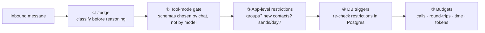
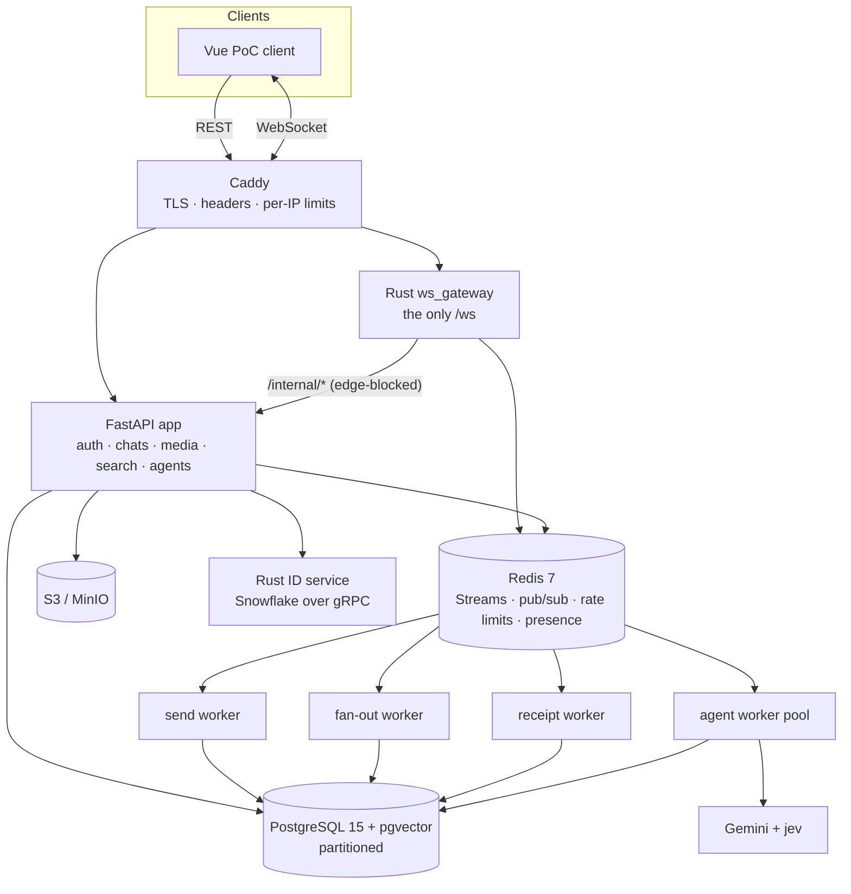

# Linka

🔗  [Live demo](https://linka-web.com)

A real-time messaging platform (WhatsApp / Telegram–style) built backend-first around two problems most chat-app tutorials skip: operating at scale, and running an autonomous AI agent as a first-class actor inside the messaging system rather than as a bolted-on chatbot widget.

Concretely, that comes down to a question:

What happens when an autonomous AI agent is a *participant* in that system, one that sends real messages, obeys real limits, and can be trusted by the person who owns it?


The agent is the part I spent the most time on, and it's the main subject of this document.

| | |
|---|---|
| **Application code** | ~24k lines of async Python · ~8.7k lines of Rust · ~12.6k lines of Vue (test client) |
| **Tests** | 800+ integration tests (~16k lines) against real Postgres, Redis and MinIO |
| **Agent subsystem** | ~10.5k lines across 50+ modules, the largest feature in the codebase |
| **Decisions** | 107 numbered Architecture Decision Records in [`docs/adr/`](docs/adr) |
| **Moving parts** | FastAPI app · Rust WebSocket gateway · Rust ID service · agent worker pool · 4 Redis-stream consumer families |

There is no production client. `poc/` is a single-page Vue app I use to exercise the backend by hand. The product is the system underneath it.

---

## Demo


https://github.com/user-attachments/assets/d717eb55-2433-45da-b0c7-02825c7d1726


> 🔍 **To more detailed, interactive diagrams:**
> - [Diagram: Message flow, from sending to delivery](https://yokuflik.github.io/LINKA/assets/diagrams/message_path.html)
> - [Decision tree: Owner and agent chat](https://yokuflik.github.io/LINKA/assets/diagrams/agent_owner_chat_flow.html)
> - [Decision tree: Chat message with a third party (routing and triggers)](https://yokuflik.github.io/LINKA/assets/diagrams/agent_owner_chat_flow.html)
---

## Contents

1. [The AI agent](#the-ai-agent)
2. [Platform architecture](#platform-architecture)
3. [Data layer](#data-layer)
4. [Security and limits](#security-and-limits)
5. [Tech stack](#tech-stack)
6. [Repository layout](#repository-layout)
7. [Running it](#running-it)
8. [Decision records](#decision-records)

---

## The AI agent

Every user can provision a personal agent. It is not a chat window wired to an LLM. It is a **service account inside the messaging system**:

- It has its own identity and acts as its owner. Messages it sends are stored with `sender_agent_id`, so they are distinguishable from the owner's own.
- It sends through the **same pipeline a human uses**: same validation, same Redis streams, same fan-out, same receipts.
- It spends the **owner's own rate-limit budget**. There is no privileged side door.
- It is **off by default** and constrained by a restrictions policy the owner controls.

### One agent, two modes

Which tools the model can see is decided by *where* the turn happens. It is never decided by anything the model says.


```mermaid
flowchart LR
    M[Inbound message] --> W{Which chat?}
    W -- "owner's private agent chat" --> C[Config mode<br/>talking to the owner]
    W -- "any other chat / schedule" --> E[Execution mode<br/>talking to the world]
    C --> CT["Config tools<br/>persona · rules · triggers<br/>schedules · identity"]
    E --> ET["Execution tools<br/>send · reply · search<br/>read history · escalate"]
```

**Execution mode** is the agent working: replying to a customer, summarizing a thread, following up. It gets 15 tools: send/reply, open or leave chats, read history (paginated), count and bulk-fetch a date range, keyword search, semantic search, knowledge-base retrieval, resend a file the owner attached earlier, and `pause_and_escalate` to hand a conversation to a human.

**Config mode** is the owner talking to their own agent in a dedicated 1:1 chat. This is where the agent gets configured and where the owner gives direct orders ("message Dana that I'm running late and tell me what she says"). Config tools can rewrite the agent's persona, restrictions, triggers and schedules, and they are physically absent from execution mode. A stranger who talks the agent into "updating its own rules" has no such tool to call.

### Inside a turn


```mermaid
flowchart TD
    A[Message arrives] --> B[Trigger engine<br/>should the agent wake?]
    B -- no --> X1[ignored]
    B -- yes --> D[Debounce + coalesce<br/>burst of messages → one turn]
    D --> Q[(agent_invoke_stream)]
    Q --> WK[Agent worker]
    WK --> J{Judge gate<br/>jev classifier}
    J -- off-topic --> R[Short redirect reply]
    J -- malicious --> ESC[Redirect + freeze chat<br/>+ notify owner]
    J -- ok --> L[Gemini function-calling loop<br/>up to 8 round-trips]
    L --> T[Tool dispatch<br/>restrictions · quotas · send-path checks]
    T --> L
    L --> O{Outcome check}
    O -- "tool failed, goal unmet" --> N[Plain-language notice to owner]
    O -- fine --> Z[Done]
```

Each stage exists because of a failure I hit or anticipated:

| Stage | What it does and why |
|---|---|
| **Trigger engine** | Wakes the agent on a time window, specific chats (optionally with keywords), a first message from a stranger, every private message, or a schedule. A Redis pre-filter keeps the common "this agent isn't interested" case away from Postgres entirely. |
| **Debounce + coalesce** | Someone who sends five messages in two seconds, or corrects themselves mid-thought, used to cause racing turns and duplicate replies. Now a matched trigger is parked on a short due-set; further messages overwrite the entry, and exactly one turn fires from the latest message. |
| **Turn mutex + supersede** | If a new message lands while a turn is mid-flight, that turn is marked superseded. It stops before it can send a stale reply, and a fresh turn answers with current history. |
| **Judge gate** | Before the main model sees a customer message, a separate classifier judges it (see below). |
| **Read receipt** | The agent marks the triggering message as read when its turn starts, as a person would. The owner's own read-receipt privacy setting still applies. |
| **Function-calling loop** | Gemini reasons and calls tools for up to 8 round-trips. Per-minute call budget is retried in place with backoff rather than failing. |
| **Outcome check** | If a turn ends on top of an unrecovered tool failure, a second classifier decides whether the owner's request actually went unmet, and the owner is told if so. |

### Two models, two jobs

A generative model is good at open-ended work and bad as its own safety layer. So the system uses two:

- **Gemini** does the reasoning and tool calling.
- **TypeSafe `jev`**, a structured classifier that answers fixed yes/no questions, does the judging. It never writes prose and can't be argued into a different verdict by a clever message.

The **message judge** asks four atomic questions about every inbound customer message: *on-topic? prompt injection? trying to extract confidential info? asking for code execution?* One call, deterministic reasons.

- **Off-topic:** the customer gets a polite redirect. A cheap Gemini call writes only that one sentence, in the customer's language.
- **Malicious:** the customer still sees only the polite redirect. The conversation is frozen and the owner is notified with the judge's own reason. No extra model call is needed, because the same verdict already carries it.
- **Media-only message** the agent can't actually inspect (judged on type, MIME and filename, never bytes): escalated to the owner for review if it's still the latest message in the chat.
- **Judge failure:** fails open to the normal turn. A classifier outage shouldn't take the agent down.

There are three other `jev` gates, each with its own rate bucket and audit table:

- The **owner-chat router** (below).
- The **attachment judge**, which checks that a file the agent is about to send matches what the person asked for.
- The **outcome judge** for tool failures.

### Talking to your own agent

When the owner writes in their agent chat, a classifier **routes the turn to a state** before the model runs. The model never moves itself between states.


```mermaid
stateDiagram-v2
    [*] --> Router: owner message
    Router --> one_off_action: "do this now / at 5pm"
    Router --> builder_agent: "from now on, always..."
    Router --> clarify: too close to call
    Router --> help_general: how does Linka work?
    Router --> help_agent_building: how do I set up an agent?
    clarify --> Router: owner answers
```

| State | Purpose |
|---|---|
| `one_off_action` (default) | Do something once, now or later. Gets the full execution toolset plus delayed tasks, "ask these people and report back" tasks, and *disposable* triggers that must expire. |
| `builder_agent` | An interview that sets up persistent behavior: persona, name, whether the agent discloses it's an AI, restrictions, triggers. The only state that can write *permanent* triggers. |
| `clarify` | The router can't tell the two apart, so the agent asks one disambiguating question instead of guessing. |
| `help_general` / `help_agent_building` | Answer questions about the product from reference docs inlined in the prompt. No tools at all. |

An earlier design let the model hand itself off between "supervisor", "builder" and "help" personas. It drifted, so the router replaced it (ADR 0093).

### Long-running work

Not everything fits in one turn:

- **Schedules:** recurring or one-off, fired as a full tool-using turn from a free-text instruction (not a canned message).
- **Ephemeral tasks:** "ask these three people X and summarize what they say." The agent messages them, collects replies through a temporary trigger, reports to the owner and cleans itself up. A timeout sweep covers people who never answer.
- **Goal-driven conversations:** hand the agent a goal, a "done when" condition and constraints, and it carries a real back-and-forth with a third party. During that conversation its `send_message` tool is hard-locked to that one chat. A six-layer termination design (prompt contract, terminal tools, no-commit-without-permission, turn and idle counters, timeout sweep) guarantees it ends with exactly one closing message to the owner.
- **Self-expiring triggers:** anything the agent creates on its own initiative must carry an expiry or a fire-count, so a one-off request can't quietly become permanent behavior.

### Knowledge and retrieval

Owners can upload documents (PDFs are parsed client-side) or have the agent save text. Content is chunked, embedded with Gemini, and stored in pgvector, scoped strictly per agent. The agent uses **agentic RAG**: it looks at an index, then pulls the specific chunks it needs. Nothing is stuffed into the prompt wholesale. When an upload succeeds or fails, the agent tells the owner itself, in its own voice, rather than a toast doing it.

### Guardrails, in layers

The assumption throughout is that a model will sometimes be wrong or manipulated, so no single layer is trusted.


```mermaid
flowchart LR
    I[Inbound message] --> L1["① Judge<br/>classify before reasoning"]
    L1 --> L2["② Tool-mode gate<br/>schemas chosen by chat, not by model"]
    L2 --> L3["③ App-level restrictions<br/>groups? new contacts? sends/day?"]
    L3 --> L4["④ DB triggers<br/>re-check restrictions in Postgres"]
    L4 --> L5["⑤ Budgets<br/>calls · round-trips · time · tokens"]
```

- **Restrictions are enforced twice.** The Python tool handler checks them, and `BEFORE INSERT/DELETE` triggers in Postgres check them again, so a bug in a handler can't bypass what the owner configured.
- **Resource budgets:** Gemini calls per minute, round-trips per turn, trigger activations per hour, per-sender quotas for strangers, a daily active-time budget, and two rolling token windows (5 hours and 7 days). The agent checks its remaining budget *before* spending a call, caps output to what's left, and tells the owner when it's exhausted instead of going silent.
- **Owner always in the loop:** bulk reads of up to 1,000 messages require an explicit owner confirmation, and the server re-verifies it. A conversation can be paused and handed to a human, with a customer-facing handoff message and an owner-facing notice. Pauses expire on their own, and the owner can resume one in plain language.
- **No internals leak.** Neither customers nor the owner ever see internal ids, judge reasons phrased as system terms, or any hint of the machinery underneath.

---

## Platform architecture


```mermaid
flowchart TB
    subgraph Clients
        POC[Vue PoC client]
    end
    POC -->|REST| CADDY[Caddy<br/>TLS · headers · per-IP limits]
    POC <-->|WebSocket| CADDY
    CADDY --> API[FastAPI app<br/>auth · chats · media · search · agents]
    CADDY --> GW[Rust ws_gateway<br/>the only /ws]
    GW -->|"/internal/* (edge-blocked)"| API
    GW --> R[(Redis 7<br/>Streams · pub/sub · rate limits · presence)]
    API --> R
    API --> PG[(PostgreSQL 15 + pgvector<br/>partitioned)]
    R --> W1[send worker]
    R --> W2[fan-out worker]
    R --> W3[receipt worker]
    R --> W4[agent worker pool]
    W1 & W2 & W3 & W4 --> PG
    API --> S3[(S3 / MinIO)]
    API --> ID[Rust ID service<br/>Snowflake over gRPC]
    W4 --> GEM[Gemini + jev]
```

**A Rust gateway owns the WebSocket.** The `/ws` endpoint was originally FastAPI. Under load, connection handling is exactly the kind of work Python is worst at, so I replaced only that piece with a standalone Rust service speaking the existing Redis contract unchanged. It handles connection lifecycle, presence, typing, per-connection rate limiting and backpressure. Python is reachable from it only through a small `/internal/*` seam that Caddy blocks from the outside. When a slow client's channel overflows, the gateway doesn't pretend nothing happened: it records the dropped chats and tells the client on the next heartbeat to refetch exactly those.

**Sending is asynchronous end to end.** A `send_message` frame only authorizes and rate-limits, pushes onto a `chat_id`-sharded Redis Stream and acks `queued`. Persistence and fan-out run in separate consumer-group workers, so write latency is decoupled from delivery latency. Fan-out looks up which processes currently serve a chat instead of using a pub/sub channel per chat, so delivering to a group costs O(servers involved), not O(members). The gateway also checks an app-liveness key before acking, so if the Python workers are down, the sender gets an honest error rather than a message that's silently stuck.

**Receipts are fire-and-forget.** Delivered/read/played are written to a stream and applied by a worker that advances watermarks and enforces the privacy rules.

**Snowflake IDs are minted by a Rust gRPC service.** IDs are unary-only, not batched, because the timestamp embedded in an id doubles as the partition-routing key, and a batch would let it go stale.

**The Python side is a feature-based modular monolith.** There is no `services/` + `routers/` + `models/` layer cake. Each feature (`messaging`, `chats`, `media`, `search`, `vector_search`, `agents`, `users`, `settings`, `auth`, `receipts`) owns its full vertical slice: models, CRUD, service, router, schemas.

---

## Data layer

- **Partitioned for scale.** `messages` is weekly range-partitioned and the detailed receipt log is daily-partitioned. An idempotent script on a committed cron creates partitions ahead of time, freezes cold ones, prunes expired ones, and migrates an overflow DEFAULT partition online. Every read path decodes the Snowflake id back into a timestamp bound first, so Postgres prunes whole partitions instead of scanning history.
- **Watermarks instead of per-message state.** Read and delivered state is a per-participant watermark rolled up to a per-chat minimum, which is O(1) regardless of group size. A separate append-only log answers "who specifically read this" on demand, with its own short retention.
- **Two search engines for two questions.** Native Postgres full-text search (a trigger-maintained `tsvector` and a `GIN` index) finds the message that *said* something. pgvector semantic search (Gemini embeddings, cosine distance, IVFFlat built only once there is real data to cluster) finds the one that *meant* it. Both enforce chat membership inside the SQL itself via a join, never a pre-fetched list of ids. Results stream over SSE with hard caps. Both support timestamp-precision date ranges.
- **Media is content-addressed.** Uploads are deduplicated by the client's SHA-256, pinned into the presigned PUT so the object store verifies it. A per-user storage quota is enforced at upload time. Images carry a sender-computed blur placeholder, so the UI can show something instantly and fetch bytes only on tap.
- **Denormalized for the common read.** The chat list carries its last-message preview and a cheap unread count instead of joining the message table on every open.

---

## Security and limits

- **Phone-number auth** via Firebase, verified server-side against Google's JWKS. Access/refresh tokens via PyJWT.
- **Transport hardening at the edge:** TLS, security headers and CSP, per-IP ceilings, host and origin allow-lists.
- **Per-user rate limiting in Redis, never in-process**, since the deployment is multi-process by design. Fixed-window and sliding-window limiters cover auth/OTP, WebSocket frames per action, connection count (evict-oldest), history, uploads and search.
- **Privacy by design:** read receipts honor a per-user setting, applied per reader in 1:1 chats. Usernames are unique and searchable only by exact match, which makes harvesting hard. A user can permanently purge their own messages, and the underlying object is deleted when its last reference goes.

---

## Tech stack

| Layer | Technology |
|---|---|
| API | FastAPI, Python 3.13, fully async |
| Realtime edge | Rust (tokio) WebSocket gateway |
| ID service | Rust gRPC Snowflake generator |
| Database | PostgreSQL 15 + pgvector, SQLAlchemy 2.0 async, asyncpg |
| Cache / streams | Redis 7: Streams, pub/sub, sliding and fixed-window limits, presence |
| Object storage | S3-compatible: MinIO in dev and CI, AWS S3 in production |
| AI reasoning | Google Gemini, function calling |
| AI classification | TypeSafe `jev` structured classifier |
| Embeddings | Gemini embeddings, pgvector (IVFFlat, cosine) |
| Auth | Firebase Phone Auth, PyJWT |
| Test client | Vue 3 + Tailwind, no build step |
| Testing | pytest, pytest-asyncio, httpx, against real services |
| Deployment | Docker Compose behind Caddy |

---

## Repository layout

```text
infra/        Cross-cutting primitives: db, redis, ids, rate limiting. No domain logic.
realtime/     Stream workers, fan-out routing, presence, the Rust gateway's internal seam.
modules/      One package per feature. agents/ is the largest:
                trigger_engine · invoke_turn_* · judge · owner_chat_router · outcome_judge
                tools/ (execution, config_mode, goal tasks) · knowledge_* · token_budget
api/          Shared request/response primitives.
crates/       Rust workspace: ws_gateway + shared common crate.
id_service/   Rust gRPC Snowflake ID service.
scripts/      Schema and storage init, partition maintenance, backfills, seeding.
poc/          Vue test client (components/ + composables/).
deploy/       Caddyfile, Postgres tuning, cron schedules, env template, runbook.
docs/adr/     Architecture Decision Records.
tests/        Integration tests against real backing services.
```

---

## Running it

Create a `.env` in the repo root (see `.env.example`) with the two API keys the AI features need:

```bash
GEMINI_API_KEY=...   # Gemini: agent reasoning, embeddings, redirect/notice authoring
JEV_API_KEY=...      # TypeSafe jev: judge, owner-chat router, outcome and attachment gates
```

Then one command starts everything:

```bash
./run_dev.sh
```

It brings up Postgres, Redis and MinIO via Docker Compose, applies the schema and creates the storage buckets, then launches the Rust ID service, the agent worker, the Rust `ws_gateway` and the FastAPI app together. Ctrl+C stops all of it. (`run_dev.sh` is git-ignored; it's a thin wrapper over the steps in `docker-compose.yml` and `scripts/`.)

Then open `poc/index.html`. In dev, OTP codes print to the server console.

**Can't get an OTP?** If the code never shows up or Firebase blocks you, log in with the whitelisted "phone numbers" **1 through 10**. They skip verification entirely, so you get ten ready-made test accounts (any code works). The list is the `DEV_AUTH_WHITELIST` setting in `.env` (default `1,2,3,4,5,6,7,8,9,10`); set it empty to turn the bypass off, and never enable it on a user-facing deployment.

To point the client at the local gateway, run this once in the browser console:

```js
localStorage.setItem('linka_ws_base', 'ws://localhost:8081')
```

Interactive API docs are at `http://localhost:8000/docs`. Without the keys the platform itself works, but the agent won't respond.

**Tests** create and drop a throwaway database per run, so seeded dev data is never touched. Run them with `pytest`.

---

## Decision records

Every material architectural, schema or infrastructure choice is written up as a numbered ADR before the code, in [`docs/adr/`](docs/adr). If you want to know *why* something looks the way it does, start there. Good entry points:

- **Message path:** 0001 (fan-out routing), 0037 (async receipts), 0060 (gap detection)
- **Rust migration:** 0011 (ID service), 0033 (WebSocket gateway), 0038 (removing the Python WS layer)
- **Search:** 0040 (full-text), 0042 (semantic)
- **The agent:** 0045 (design), 0047 (tool-mode gate), 0053 (judge), 0063 (debounce), 0066 (DB-level restrictions), 0093 (owner-chat router), 0096 (outcome judge), 0099 (goal tasks)

**Deliberately out of scope:** a production client, voice and video calls, a migration framework (the schema is applied idempotently by script), and multi-host scale-out. The architecture is built for it, but the current deployment is a single-host demo.
